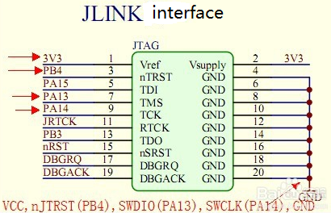
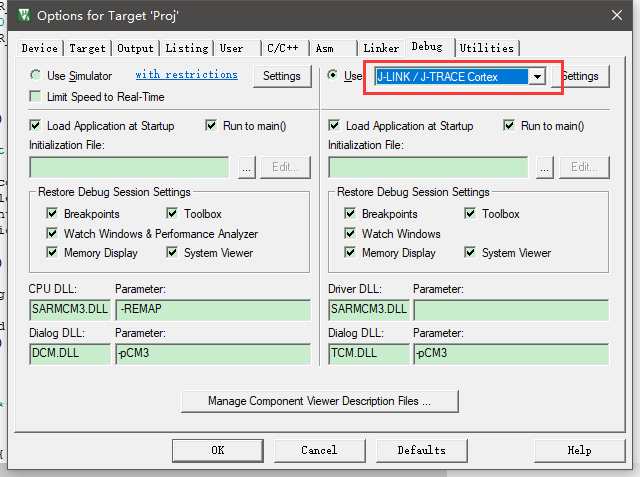

# BPi-BC95-Linaro Easy to Use

- ## MCU part

Power supply : Micro USB or 3.7V Li-ion

Debugging tools : IDE(MDK5&STM32F1XX Package) \ Jlink \ four or five DuPont lines

（Development board hardware design fixed SWD debug mode, you can not use the serial port to download.）

**How to connect?**

JLink and BPI NB-IoT Linaro SWD mode connection:

MDK5 “Options for Target” — “Debug” setting：

First need to build the project file based on the corresponding chip, and in the Options of Target do the following settings

（Project file specific settings include but are not limited to the following settings）

（Development board needs to be kept powered）

Debug method：

1.	You can use the debug serial port (MCU USART1) to debug.

2.	Use Micro USB virtual serial port for debugging.
The above two methods require MCU program support

Note：

1.	Debug serial port, SWD simulation interface spacing 2.54mm, GPIO pitch 2.0mm

2.	The LED next to the Micro USB is the power indicator, which should be on after any power-up.
 
- ## NB-Iot part

This module needs to be used with NB_IOT SIM card.

Different carriers support different frequency bands，Module operating frequency band to distinguish the module model，such as：

##### Firmware version：

Query firmware instructions：AT+CGMR

Result：V100R100C10B656SP2  firmware version is B656SP2

##### Scramble code function：

The module is consistent with the base station.

##### SIM Card:

The module can used two kinds of SIM card. Standard SIM card or eSIM card.

##### Antenna:

The module has reserved the MHF WiFi antenna interface, which can be selected according to the actual usage of the product.
